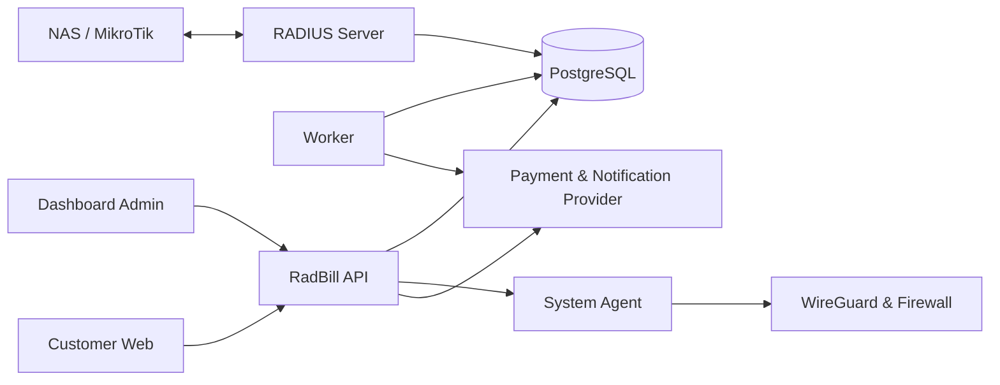

# RadBill

Platform billing dan operasional ISP untuk mengelola pelanggan, layanan,
penagihan, pembayaran, RADIUS, notifikasi, dan portal mandiri pelanggan dalam
satu sistem multi-organisasi.

RadBill didistribusikan sebagai **binary berlisensi**. Source backend, dashboard
admin, worker, runtime RADIUS, agent sistem, dan license manager tidak
didistribusikan melalui repository publik. Source `customer-web` tersedia agar
pengguna berlisensi dapat menyesuaikan portal pelanggannya sendiri.

> [!IMPORTANT]
> RadBill bukan perangkat lunak open-source. Penggunaan aplikasi dan source
> `customer-web` tunduk pada perjanjian lisensi RadBill. Ketersediaan source
> portal tidak memberikan hak untuk menyalin, menjual kembali, atau
> mendistribusikan aplikasi di luar ketentuan lisensi.

## Fitur utama

- Manajemen organisasi, user, role, permission, reseller, dan audit log.
- Data pelanggan, subscription, paket layanan, addon, dan perubahan paket.
- Billing, invoice, pembayaran, dompet, kas operasional, dan laporan keuangan.
- Akun PPPoE dan hotspot, profil layanan, sesi RADIUS, serta import/export akun.
- Manajemen NAS, WireGuard, IP pool, firewall RADIUS, dan pemeriksaan SNMP.
- Payment gateway, payment link publik, top-up, dan pembelian voucher hotspot.
- Notifikasi email, push notification, WhatsApp, serta bot Telegram.
- Portal pelanggan untuk layanan aktif, invoice, pembayaran, profil, addon,
  pengaturan Wi-Fi, dan preferensi notifikasi.
- Integrasi TR-069/GenieACS untuk perangkat jaringan pelanggan.
- Branding organisasi, status service, lisensi, dan pembaruan aplikasi.

Ketersediaan fitur dapat mengikuti edisi lisensi dan versi aplikasi yang
digunakan.

## Komponen aplikasi



| Komponen | Fungsi |
| --- | --- |
| `api` | API utama, dashboard admin, halaman publik, dan penyajian portal pelanggan |
| `worker` | Otomatisasi billing, scheduled job, notifikasi, dan sinkronisasi berkala |
| `radius-server` | Autentikasi serta accounting RADIUS |
| `radbill-agent` | Operasi WireGuard dan firewall terbatas pada server Linux |
| `radbill-update-agent` | Pemeriksaan dan pemasangan pembaruan melalui dashboard |
| `customer-web` | Source portal pelanggan yang dapat dikustomisasi dan dibangun terpisah |

## Platform yang didukung

Deployment production menggunakan Ubuntu/Debian dengan systemd. Paket rilis
tersedia sesuai arsitektur yang diterbitkan:

- Linux `amd64`
- Linux `arm64`

Installer menyiapkan PostgreSQL, user service, konfigurasi, systemd unit, log
rotation, runtime aplikasi, serta agent yang diperlukan. WireGuard dapat
diaktifkan saat instalasi.

## Instalasi

> [!WARNING]
> **Jangan memasang atau menjalankan versi ini bersamaan dengan [RadBill versi lama](https://github.com/radbill/radbill) pada server yang sama.**
> Kedua aplikasi dapat memakai resource sistem yang sama, terutama port UDP
> RADIUS `1812` (authentication) dan `1813` (accounting), serta berpotensi
> berbenturan pada port aplikasi seperti `8080`, service systemd, direktori
> instalasi, konfigurasi, dan database. Konflik tersebut dapat membuat service
> gagal aktif atau, lebih berbahaya, mengarahkan request RADIUS dan data ke
> instance yang salah.

Gunakan VPS/server terpisah selama pengujian atau migrasi. Jika versi baru harus
dipasang pada server lama, backup database dan konfigurasi terlebih dahulu,
siapkan prosedur migrasi, lalu hentikan seluruh service RadBill lama sebelum
menjalankan installer baru. Installer versi ini bukan alat migrasi otomatis dan
tidak menghapus instalasi lama.

Periksa apakah port utama masih digunakan sebelum instalasi:

```bash
sudo ss -lntup | grep -E ':(1812|1813|8080)([[:space:]]|$)'
```

Jika perintah menampilkan proses RadBill lama, jangan lanjutkan sampai proses
tersebut dihentikan atau instalasi dipindahkan ke server yang terpisah.

### 1. Instalasi otomatis (disarankan)

Jalankan perintah berikut pada Ubuntu/Debian:

```bash
wget -qO- https://raw.githubusercontent.com/radbill/radbill-3.0/main/install.sh | sudo bash
```

Bootstrap akan mendeteksi arsitektur server, mengunduh installer dan ZIP runtime
dari GitHub Release terbaru, memverifikasi checksum keduanya, lalu menjalankan
installer interaktif sebagai `root`.

Untuk memasang release tertentu:

```bash
wget -qO- https://raw.githubusercontent.com/radbill/radbill-3.0/main/install.sh |
  sudo env RADBILL_RELEASE=v1.0.0.53 bash
```

Untuk instalasi noninteraktif:

```bash
wget -qO- https://raw.githubusercontent.com/radbill/radbill-3.0/main/install.sh |
  sudo env RADBILL_INSTALL_ADMIN_PASSWORD='gunakan-password-kuat' \
  bash -s -- \
    --yes \
    --admin-email admin@example.com \
    --public-app-url https://example.com \
    --public-api-url https://example.com
```

Password melalui environment lebih aman daripada argumen command karena argumen
dapat terlihat pada daftar proses. Jika password tidak diberikan, installer akan
membuat password acak dan menampilkannya satu kali.

Jika ingin memeriksa isi bootstrap sebelum menjalankannya, unduh sebagai file:

```bash
wget https://raw.githubusercontent.com/radbill/radbill-3.0/main/install.sh
less install.sh
chmod +x install.sh
sudo ./install.sh
```

Perintah melalui `raw.githubusercontent.com` memerlukan repository dan branch
yang dapat dibaca oleh server. Untuk repository private, unduh script dan asset
release menggunakan kredensial read-only melalui mekanisme distribusi privat.

### 2. Instalasi manual dari asset release

Buka halaman **Releases** repository ini, pilih versi terbaru, lalu unduh empat
asset dengan arsitektur yang sama. Contoh untuk `amd64`:

```text
installer-linux-amd64
installer-linux-amd64.sha256
radbill-linux-amd64.zip
radbill-linux-amd64.zip.sha256
```

Jangan mengganti nama asset. Letakkan installer dan ZIP di folder yang sama,
lalu verifikasi keduanya menggunakan file checksum yang disediakan pada release.

```bash
chmod +x installer-linux-amd64
sudo ./installer-linux-amd64
```

Ikuti pertanyaan pada installer untuk mengatur administrator awal, URL publik,
repository update, dan WireGuard. Untuk melihat seluruh opsi:

```bash
./installer-linux-amd64 --help
```

Untuk instalasi noninteraktif:

```bash
sudo RADBILL_INSTALL_ADMIN_PASSWORD='gunakan-password-kuat' \
  ./installer-linux-amd64 \
  --yes \
  --admin-email admin@example.com \
  --public-app-url https://billing.example.com \
  --public-api-url https://billing.example.com
```

### 3. Periksa service

```bash
systemctl status radbill-api radbill-worker radbill-radius radbill-agent
curl http://127.0.0.1:8080/healthz
curl http://127.0.0.1:8080/readyz
```

Log default tersedia di:

```text
/var/log/radbill/api.log
/var/log/radbill/worker.log
/var/log/radbill/radius.log
```

Konfigurasi utama disimpan di `/etc/radbill/radbill.env`. File tersebut berisi
secret dan hanya boleh diakses oleh akun sistem yang membutuhkannya.

## Aktivasi lisensi

Setiap instalasi memerlukan license key yang valid. Masukkan konfigurasi yang
diberikan bersama lisensi ke `/etc/radbill/radbill.env`:

```dotenv
RADBILL_LICENSE_KEY=<license-key>
```

Setelah konfigurasi disimpan:

```bash
sudo systemctl restart radbill-api
curl http://127.0.0.1:8080/api/license/status
```

Verifikasi ulang juga dapat dijalankan dari dashboard atau melalui endpoint
`POST /api/license/refresh` oleh user yang berwenang.

Lisensi terikat pada installation ID server. Jangan menyalin installation ID ke
server lain. Gunakan prosedur reset HWID dari pengelola lisensi saat memigrasikan
instalasi.

Jika masa aktif berakhir, API administratif memasuki mode terbatas setelah grace
period. Worker, RADIUS, accounting, webhook, endpoint publik, dan portal
pelanggan tetap berjalan agar layanan pelanggan tidak terputus mendadak.

## Kustomisasi customer web

Folder [`customer-web`](customer-web/) adalah satu-satunya source aplikasi yang
disediakan untuk kustomisasi. Portal dibangun menggunakan React, TypeScript,
Vite, dan PWA.

Bagian yang umum disesuaikan:

- warna, tipografi, spacing, radius, dan shadow pada `src/styles/tokens.css`;
- logo, favicon, dan ikon PWA pada `public/`;
- teks, layout, serta komponen portal pada `src/features/portal/`;
- halaman login dan verifikasi OTP pada `src/features/auth/`.

### Menjalankan portal saat development

Prasyaratnya adalah Node.js dan npm.

```bash
cd customer-web
npm ci
npm run dev
```

Untuk development lokal, Vite meneruskan `/api` ke
`http://localhost:8080`. Portal menggunakan base path `/portal/`; pertahankan
base path tersebut agar route dan service worker tetap kompatibel dengan RadBill.

### Build portal

```bash
cd customer-web
npm ci
npm run lint
npm run build
```

Hasil build tersedia di `customer-web/dist/`. Portal berkomunikasi dengan API
melalui `/api` pada origin yang sama. Jangan menaruh credential server, license
key, private key, atau secret provider di source frontend maupun variable build
Vite karena nilainya dapat dibaca dari browser.

### Pasang hasil kustomisasi

Secara default API membaca portal dari folder `customer` di samping binary API.
Pada instalasi Linux standar, salin isi `dist/` ke:

```text
/opt/radbill/bin/customer/
```

Contoh pemasangan:

```bash
sudo install -d -m 0755 -o radbill -g radbill /opt/radbill/bin/customer
sudo cp -R customer-web/dist/. /opt/radbill/bin/customer/
sudo chown -R radbill:radbill /opt/radbill/bin/customer
```

Portal akan tersedia pada `https://domain-anda/portal/`. API membaca file portal
langsung dari disk sehingga restart biasanya tidak diperlukan. Jika lokasi ingin
diubah, atur `CUSTOMER_WEB_DIR` pada `/etc/radbill/radbill.env`, pastikan service
API memiliki akses baca, lalu restart `radbill-api`.

Simpan backup portal kustom Anda sebelum memasang pembaruan atau mengganti hasil
build. Setelah deploy, uji login, navigasi langsung ke route portal, pembayaran,
dan pembaruan service worker pada browser.

## Pembaruan aplikasi

Pembaruan dapat dijalankan dari menu **Platform → Pembaruan Sistem** oleh
`super_admin` yang memiliki permission `platform.update`, atau dari server:

```bash
sudo radbill-update --check-online
sudo radbill-update --yes
```

Gunakan release tertentu bila diperlukan:

```bash
sudo radbill-update --release v1.0.0.46 --yes
```

Updater memverifikasi versi, arsitektur, dan checksum binary; membuat backup
database serta runtime; mengaktifkan binary secara atomik; menjalankan health
check; dan melakukan rollback binary otomatis bila aktivasi gagal. Konfigurasi,
database, log, serta branding organisasi tidak ditimpa.

> [!NOTE]
> Source dan hasil build `customer-web` yang Anda kustomisasi dikelola terpisah
> dari update binary. Periksa catatan rilis untuk mengetahui perubahan kontrak
> portal atau langkah migrasi yang mungkin diperlukan.

## Keamanan operasional

- Gunakan HTTPS melalui reverse proxy untuk seluruh akses publik.
- Batasi PostgreSQL, endpoint worker, RADIUS metrics, `radbill-agent`, dan
  `radbill-update-agent` dari internet publik.
- Ganti seluruh password dan secret bawaan sebelum production.
- Jangan membagikan license key, installation ID, file environment, backup
  database, atau token GitHub.
- Verifikasi checksum dan signature asset sebelum instalasi atau update.
- Simpan backup database di lokasi terpisah dan uji prosedur pemulihannya.
- Laporkan dugaan celah keamanan melalui kanal dukungan privat, bukan issue
  GitHub publik.

## Lisensi dan hak penggunaan

RadBill adalah aplikasi proprietary dan dilindungi oleh sistem lisensi. Hak untuk
menggunakan, menyalin, memodifikasi, mendistribusikan, atau menyediakan kembali
binary dan komponen aplikasi ditentukan oleh perjanjian lisensi resmi RadBill.

Source `customer-web` diberikan untuk memungkinkan kustomisasi portal pada
instalasi RadBill yang memiliki lisensi aktif. Hak penggunaan, modifikasi, dan
distribusinya tetap mengikuti dokumen perjanjian lisensi yang menyertai produk.
Jika README ini berbeda dengan perjanjian lisensi resmi, ketentuan pada perjanjian
lisensi resmi yang berlaku.
